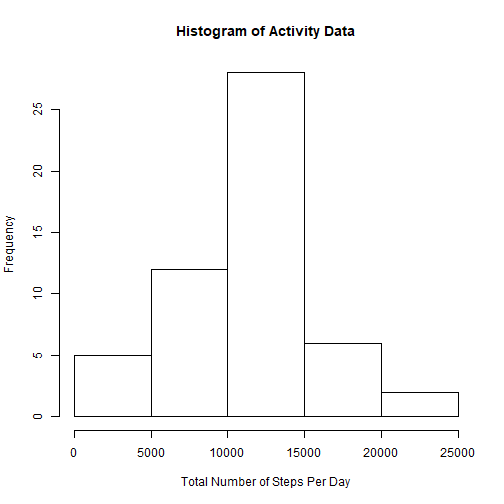
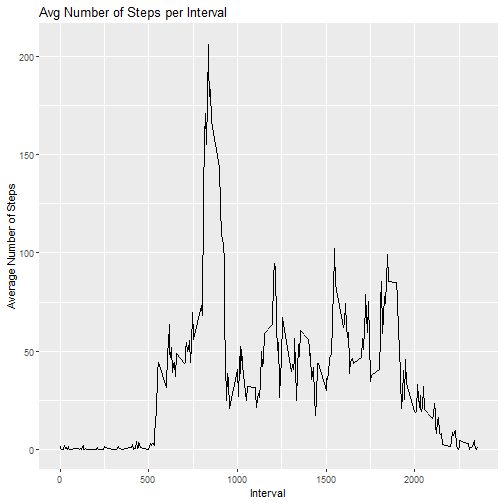
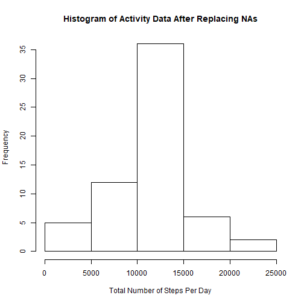
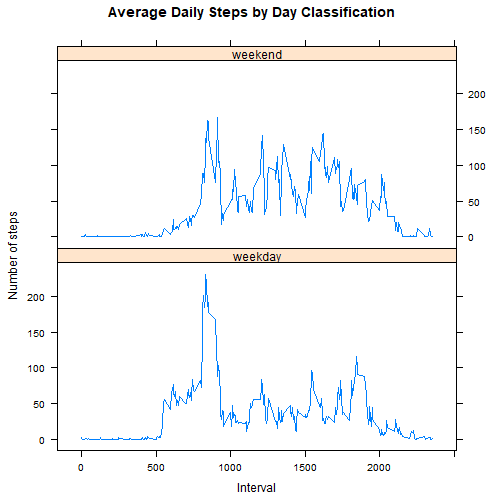

Reproducible Research - Course Project 1 - Analyzing Activity Monitoring Data

Author: Jessica Shiao

==========================================

The activity data used in this assignment comes from a personal activity monitoring device (e.g. Nike Fuelband, Fitbit, or JawboneUp). This device collects data at 5 minute intervals through out the day. The data consists of two months of data from an anonymous individual collected during the months of October and November, 2012 and include the number of steps taken in 5 minute intervals each day.

Make sure your working directory is set to the folder path where the activity data file located.

1. Loading and preprocessing the data

Load the knitr, dplyr, lattice, ggplot2 and lubridate packages.


```r
library(knitr)
library(dplyr)
library(lubridate)
library(lattice)
library(ggplot2)
```

Read the activity data csv file into R and remove all lines with NA.


```r
activityData <- read.csv("activity.csv")
activityData_noNA <- na.omit(activityData)
head(activityData_noNA)
```

```
##     steps       date interval
## 289     0 2012-10-02        0
## 290     0 2012-10-02        5
## 291     0 2012-10-02       10
## 292     0 2012-10-02       15
## 293     0 2012-10-02       20
## 294     0 2012-10-02       25
```

2. What is the mean total number of steps taken per day?

**Calculate the total number of steps taken per day.**


```r
activityData_stepsperday <- 
    activityData_noNA %>%
    group_by(date) %>%
    summarize(Total_Number_of_Steps = sum(steps))
head(activityData_stepsperday)
```

```
## # A tibble: 6 x 2
##   date       Total_Number_of_Steps
##   <fct>                      <int>
## 1 2012-10-02                   126
## 2 2012-10-03                 11352
## 3 2012-10-04                 12116
## 4 2012-10-05                 13294
## 5 2012-10-06                 15420
## 6 2012-10-07                 11015
```

**Make a histogram of the total number of steps taken each day.**


```r
hist(activityData_stepsperday$Total_Number_of_Steps, 
     main = "Histogram of Activity Data", 
     xlab = "Total Number of Steps Per Day")
```



**Calculate and report the mean and median of the total number of steps taken per day.**

Mean of the total number of steps taken per day:

```r
mean(activityData_stepsperday$Total_Number_of_Steps)
```

```
## [1] 10766.19
```

Median of the total number of steps taken per day:

```r
median(activityData_stepsperday$Total_Number_of_Steps)
```

```
## [1] 10765
```

3. What is the average daily activity pattern?

**Make a time series plot (i.e. type = "1") of the 5-minute interval(x-axis) and the average number of steps taken, averaged across all days (y-axis).**


```r
activityData_stepsperint <- 
    activityData_noNA %>%
    group_by(interval) %>%
    summarize(Mean_Number_of_Steps = mean(steps))
head(activityData_stepsperint)
```

```
## # A tibble: 6 x 2
##   interval Mean_Number_of_Steps
##      <int>                <dbl>
## 1        0               1.72  
## 2        5               0.340 
## 3       10               0.132 
## 4       15               0.151 
## 5       20               0.0755
## 6       25               2.09
```


```r
ggplot(activityData_stepsperint, aes(interval, Mean_Number_of_Steps)) + geom_line() + ggtitle("Avg Number of Steps per Interval") + xlab("Interval") + ylab("Average Number of Steps")
```



**Which 5-minute interval, on average across all the days in the dataset contains the maximum number of steps?**


```r
activityData_stepsperint[which.max(activityData_stepsperint$Mean_Number_of_Steps), 1]
```

```
## # A tibble: 1 x 1
##   interval
##      <int>
## 1      835
```

4. Imputing missing values

**Calculate and report the total number of missing values in the dataset (i.e. the total number of rows with NAs).**


```r
sum(is.na(activityData))
```

```
## [1] 2304
```

**Devise a strategy for filling in all of the missing values in the dataset. The strategy does not need to be sophisticated. For example, you could use the mean/median for that day, or the mean for that 5-minute interval,etc. **

**Create a new dataset that is equal to the original dataset but with the missing data filled in.**

In my analysis, I filled in all of the missing values in the data set using the mean for that interval (activityData_stepsperint). I did this by performing a left join of the original activity data with the activity data that includes the average steps per interval (activityData_stepsperint). Then, I replaced any NA values in the 'steps' column with the average steps per interval data.


```r
activityData_merge <- activityData %>% merge(activityData_stepsperint, by.x = "interval", by.y= "interval", all.x = TRUE) %>% arrange(date, interval)
activityData_replace <- activityData_merge
activityData_replace$steps <- ifelse(is.na(activityData_replace$steps), activityData_replace$Mean_Number_of_Steps, activityData_replace$steps)
activityData_replace$Mean_Number_of_Steps <- NULL
activityData_replace <- activityData_replace[,c(2, 3, 1)]
head(activityData_replace)
```

```
##       steps       date interval
## 1 1.7169811 2012-10-01        0
## 2 0.3396226 2012-10-01        5
## 3 0.1320755 2012-10-01       10
## 4 0.1509434 2012-10-01       15
## 5 0.0754717 2012-10-01       20
## 6 2.0943396 2012-10-01       25
```

**Make a histogram of the total number of steps taken each day.**


```r
activityData_replace_stepsperday <- 
    activityData_replace %>%
    group_by(date) %>%
    summarize(Total_Number_of_Steps = sum(steps))
head(activityData_replace_stepsperday)
```

```
## # A tibble: 6 x 2
##   date       Total_Number_of_Steps
##   <fct>                      <dbl>
## 1 2012-10-01                10766.
## 2 2012-10-02                  126 
## 3 2012-10-03                11352 
## 4 2012-10-04                12116 
## 5 2012-10-05                13294 
## 6 2012-10-06                15420
```


```r
hist(activityData_replace_stepsperday$Total_Number_of_Steps, 
     main = "Histogram of Activity Data After Replacing NAs", 
     xlab = "Total Number of Steps Per Day")
```



**Calculate and report the mean and median total number of steps taken per day.**

Mean of the total number of steps taken per day:

```r
mean(activityData_replace_stepsperday$Total_Number_of_Steps)
```

```
## [1] 10766.19
```

Median of the total number of steps taken per day:

```r
median(activityData_replace_stepsperday$Total_Number_of_Steps)
```

```
## [1] 10766.19
```

**Do these values differ from the estimates from the first part of the assignment?**

The mean of the total number of steps taken per day after replacing the NAs does not differ from the first part of the assignment. The median of the total number of steps taken per day after replacing the NAs is slightly greater than the median from the first part of the assignment.

**What is the impact of imputing missing data on the estimates of the total daily number of steps?**

Although the proportion of days with the various Total Number of Steps Per Day breaks has not changed, the frequency of the number of days with a Total Number of Steps Per Day between 10000 and 15000 has increased since the dates that originally had no values (NAs) and were excluded from the first part of the assignment now have a total number of steps of 10766.9 due to the replacement of the NA values in the steps column with the average steps per interval data.

5. Are there differences in activity patterns between weekdays and weekends? Use the dataset with the filled-in missing values for this part.

**Create a new factor variable in the dataset with two levels - "weekday" and "weekend" indicating whether a given date is a weekday or weekend day.** 

First, I had to change the date column to "Date" class. Then, I created the column "day"" to determine the day of the week of the date. Finally, I created the column "classify" to indicate whether the date was on a weekend or a weekday.


```r
activityData_replace_date <- activityData_replace
activityData_replace_date <- mutate(activityData_replace_date, date = ymd(date))
activityData_replace_date <- mutate(activityData_replace_date, day = wday(date))
activityData_replace_date$classify <- ifelse(activityData_replace_date$day %in% c(1, 7), "weekend", "weekday")
activityData_replace_date$classify <- factor(activityData_replace_date$classify)
head(activityData_replace_date)
```

```
##       steps       date interval day classify
## 1 1.7169811 2012-10-01        0   2  weekday
## 2 0.3396226 2012-10-01        5   2  weekday
## 3 0.1320755 2012-10-01       10   2  weekday
## 4 0.1509434 2012-10-01       15   2  weekday
## 5 0.0754717 2012-10-01       20   2  weekday
## 6 2.0943396 2012-10-01       25   2  weekday
```

**Make a panel plot containing a time series plot (i.e. type = "1") of the 5-minute interval(x-axis) and the average number of steps taken, averaged across all weekday days or weekend days (y-axis).**


```r
stepsbylevel <- aggregate(steps ~ interval + classify, data = activityData_replace_date, mean)
names(stepsbylevel) <- c("interval", "level", "steps")

xyplot(steps ~ interval | level, stepsbylevel, type = "l", layout = c(1, 2), 
       xlab = "Interval", ylab = "Number of steps", main = "Average Daily Steps by Day Classification")
```



knit2html("pa1_template.Rmd")
